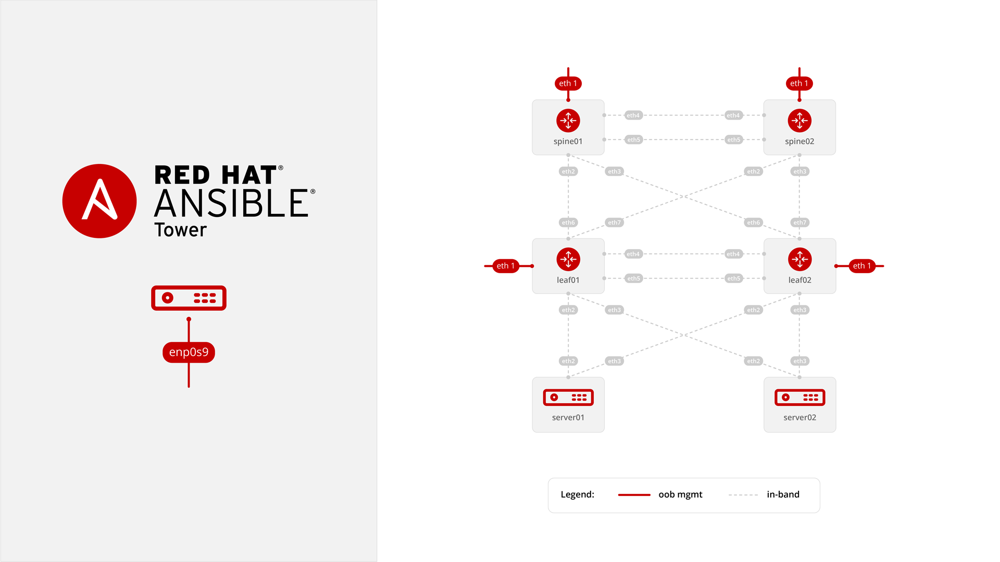

# Directions

## Requirements

1. Install vagrant

   Download here: <a href="https://www.vagrantup.com/downloads.html" target="_blank">https://www.vagrantup.com/downloads.html</a>

2. Install VirtualBox

   Download here: <a href="https://www.virtualbox.org/wiki/Downloads" target="_blank">https://www.virtualbox.org/wiki/Downloads</a>

3. Install Git (Optional)

   Download here: <a href="https://git-scm.com/book/en/v2/Getting-Started-Installing-Git" target="_blank">https://git-scm.com/book/en/v2/Getting-Started-Installing-Git</a>

## Setup

1. Download Vagrantfile **OR** git clone this repo

    * **Choice 1** Download Vagrantfile

       <a href="https://raw.githubusercontent.com/IPvSean/ansible-networking-vagrant-demo/master/Vagrantfile" download="Vagrantfile">Click here to download</a>

    * **Choice 2** git clone this repo  

       ```bash
       git clone https://github.com/IPvSean/ansible-networking-vagrant-demo
       ```

4. Open up a terminal window in the same directory as the Vagrantfile

   For example if you downloaded the Vagrantfile to your Macbook in your Downloads folder->

    1. Press command ⌘ + spacebar and type `terminal` in the *Spotlight Search* and press the return key
    2. Switch to the Downloads directory

       ```bash
       SEANs-MacBook-Pro:~ sean$ cd Downloads
       ```

5. Turn on the following VMs

   ```bash
   vagrant up leaf01 leaf02 spine01 spine02 ansible
   ```

6. Grab a beer/soda/coffee

   takes about 5 minutes

7. Begin Exercises

   Once vagrant finishes provisioning, check out the [training course](training-course) and follow directions there.

# Vagrant Topology



 ---


Red Hat® Ansible® Automation includes three products:

- [Red Hat® Ansible® Engine](https://www.ansible.com/ansible-engine): a fully supported product built on the foundational capabilities of the Ansible project.

- [Red Hat® Ansible® Networking Add-On](https://www.ansible.com/ansible-engine): provides support for select networking modules from Arista (EOS), Cisco (IOS, IOS XR, NX-OS), Juniper (Junos OS), Open vSwitch, and VyOS.

- [Red Hat® Ansible® Tower](https://www.ansible.com/tower): makes it easy to scale automation, manage complex deployments and speed productivity. Extend the power of Ansible with workflows to streamline jobs and simple tools to share solutions with your team.

Want more info?
[Read this blog post for more info about Engine, the networking add-on and Tower](https://www.ansible.com/blog/red-hat-ansible-automation-engine-vs-tower)
