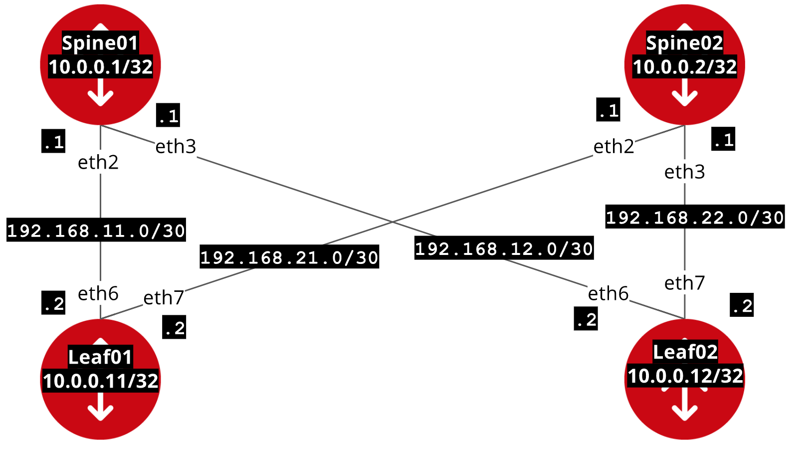

# Exercise 05 - Configuring OSPF Routing

For this exercise we are going to configure [OSPF routing](https://en.wikipedia.org/wiki/Open_Shortest_Path_First) using the [vyos_config](http://docs.ansible.com/ansible/latest/vyos_config_module.html) module.  We are going to put every interface into area 0, using the **interface_data** from before.

## Table of Contents

- [Diagram](#Diagram)
- [Jinja Templates](#jinja-templates)
- [The Playbook](#the-playbook)
- [Looking at the results](#looking-at-the-results)
- [Complete](#complete)

## Diagram
Here is the IP address diagram from the previous exercise:


## Jinja Templates

On Linux hosts we can use the [template module](http://docs.ansible.com/ansible/latest/template_module.html) to render [jinja templates](http://jinja.pocoo.org/).  When using the connection **network_cli** the template module will just run locally for both the src and dest (as opposed to with Linux hosts where the src will be on the control node, and the dest will be on the inventory device the Playbook is being run against).  Lets look at a task of this:

```
- name: create routing config
  template:
    src: ./test.j2
    dest: ./test_config/test.cfg
```

The vars for this example are:

```yaml
spine01:
  loopback: 10.0.0.1/32
```

The test.j2 for this example is:
```
loopback lo {
    address {{spine01.loopback}}
}
```

Running the task above will render test.cfg:

```yaml
loopback lo {
    address 10.0.0.1/32
}
```

Jinja2 is very powerful and has lots of features.  The most commonly used ones to template configs are conditionals and loops [which you can read more about here](http://jinja.pocoo.org/docs/2.10/templates/).  With the networking **os_config** modules (i.e. vyos_config) the src can set from a jinja template.  This means you don't need two tasks to render, then push config.

## The Playbook
Look at the following playbook:

```yml
---
- hosts: network
  connection: network_cli
  vars:
    interface_data:
      spine01:
          - { name: lo, ipv4: 10.0.0.1/32 }
          - { name: eth2, ipv4: 192.168.11.1/30 }
          - { name: eth3, ipv4: 192.168.12.1/30 }
      spine02:
          - { name: lo, ipv4: 10.0.0.2/32 }
          - { name: eth2, ipv4: 192.168.21.1/30 }
          - { name: eth3, ipv4: 192.168.22.1/30 }
      leaf01:
          - { name: lo, ipv4: 10.0.0.11/32 }
          - { name: eth6, ipv4: 192.168.11.2/30 }
          - { name: eth7, ipv4: 192.168.21.2/30 }
      leaf02:
          - { name: lo, ipv4: 10.0.0.12/32 }
          - { name: eth6, ipv4: 192.168.12.2/30 }
          - { name: eth7, ipv4: 192.168.22.2/30 }
  tasks:
    - name: push config to device
      vyos_config:
        src: ./ospf.j2
        save: yes
```

To run the playbook use the `ansible-playbook` command.  The default password is **vagrant** for the vyos vagrant image.

```bash
ansible-playbook ospf.yml -u vagrant -k
```
Parameter | Explanation
------------ | -------------
ansible-playbook | Ansible executable for running playbooks
system.yml | the name of the playbook
-u vagrant | specifies user vagrant
-k | prompts us for password

# Looking at the results

Login to a device:
```
ssh vagrant@spine01
```

Use the `show ip ospf neigh` command to look for OSPF neighborship adjacencies

```
vagrant@spine01:~$ show ip ospf neigh

    Neighbor ID Pri State           Dead Time Address         Interface            RXmtL RqstL DBsmL
10.0.0.11         1 Full/DROther      32.272s 192.168.11.2    eth2:192.168.11.1        0     0     0
10.0.0.12         1 Full/DROther      32.245s 192.168.12.2    eth3:192.168.12.1        0     0     0
```

Check the route table with the `show ip route` command.  There should be a route for 10.0.0.1, 10.0.0.2, 10.0.0.11 and 10.0.0.12 which represent the 4 vyos devices:

Device | Loopback Address
------------ | -------------
spine01 | 10.0.0.1
spine02 | 10.0.0.2
leaf01 | 10.0.0.11
leaf02 | 10.0.0.12


```
vagrant@spine01:~$ show ip route
Codes: K - kernel route, C - connected, S - static, R - RIP, O - OSPF,
       I - ISIS, B - BGP, > - selected route, * - FIB route

S>* 0.0.0.0/0 [210/0] via 10.0.2.2, eth0
O   10.0.0.1/32 [110/10] is directly connected, lo, 00:15:16
C>* 10.0.0.1/32 is directly connected, lo
O>* 10.0.0.2/32 [110/30] via 192.168.11.2, eth2, 00:15:14
  *                      via 192.168.12.2, eth3, 00:15:14
O>* 10.0.0.11/32 [110/20] via 192.168.11.2, eth2, 00:15:17
O>* 10.0.0.12/32 [110/20] via 192.168.12.2, eth3, 00:15:16
C>* 10.0.0.111/32 is directly connected, lo
C>* 10.0.2.0/24 is directly connected, eth0
C>* 127.0.0.0/8 is directly connected, lo
C>* 172.16.10.0/24 is directly connected, eth1
O   192.168.11.0/30 [110/10] is directly connected, eth2, 01:05:34
C>* 192.168.11.0/30 is directly connected, eth2
O   192.168.12.0/30 [110/10] is directly connected, eth3, 01:36:03
C>* 192.168.12.0/30 is directly connected, eth3
O>* 192.168.21.0/30 [110/20] via 192.168.11.2, eth2, 00:54:48
O>* 192.168.22.0/30 [110/20] via 192.168.12.2, eth3, 00:54:40
```

We can also automate checking the results.  Using the [vyos_command](http://docs.ansible.com/ansible/latest/vyos_command_module.html) to ping the loopback addresses of each switch, and then using the [assert module](http://docs.ansible.com/ansible/latest/assert_module.html) we can make sure we have full reachability.  Check out the following playbook:

```yaml
- hosts: network
  connection: network_cli
  tasks:
    - name: Test reachability from all devices to all devices
      vyos_command:
        commands:
          - "ping 10.0.0.1 count 2"
          - "ping 10.0.0.2 count 2"
          - "ping 10.0.0.11 count 2"
          - "ping 10.0.0.12 count 2"
      register: ping_result

    - name: assert test results
      assert:
        that:
          - "'10.0.0.1' in ping_result.stdout[0]"
          - "'0% packet loss' in ping_result.stdout[0]"
          - "'10.0.0.2' in ping_result.stdout[1]"
          - "'0% packet loss' in ping_result.stdout[1]"
          - "'10.0.0.11' in ping_result.stdout[2]"
          - "'0% packet loss' in ping_result.stdout[2]"
          - "'10.0.0.12' in ping_result.stdout[3]"
          - "'0% packet loss' in ping_result.stdout[3]"
```

To run the playbook use the `ansible-playbook` command.  The default password is vagrant for the vyos vagrant image.

```bash
ansible-playbook check.yml -u vagrant -k
```

## Complete
You have completed exercise 05.

[Return to training-course](../README.md)
