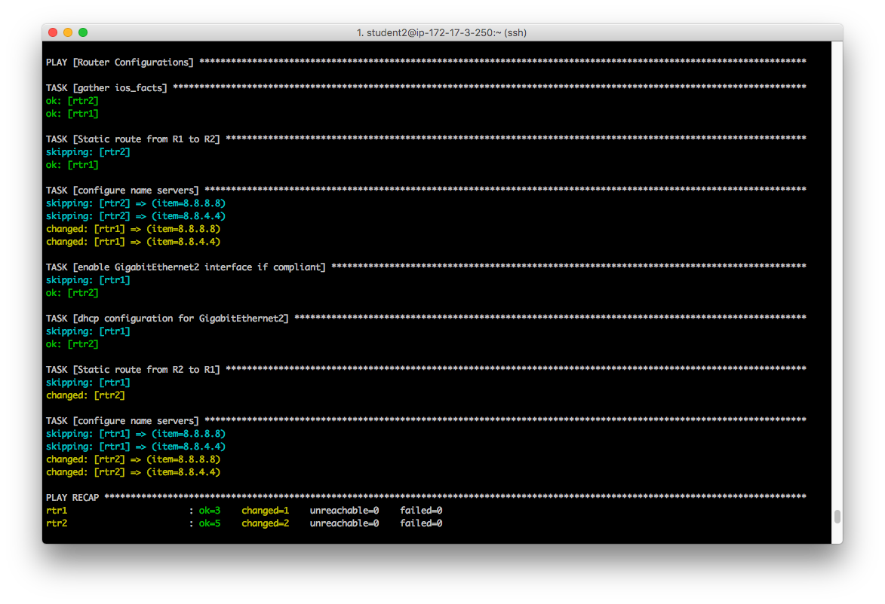

# Exercise 1.5 - Executing your playbook and review

Congratulations! You just wrote a playbook that incorporates some key Ansible concepts that you use in most if not all of your future playbooks. Before you get too excited though, we should probably make sure it actually runs.  If there is problems with your playbook, one is provided here: [router_configs.yml](router_configs.yml)

## Table of Contents
 - [Section 1 - Running your routing_configs playbook](#section-1---running-your-routing_configs-playbook)
 - [Section 2: Review](#section-2-review)
 - [Section 3: Test!](#section-3-test)

## Section 1 - Running your routing_configs playbook

### Step 1: Make sure you are in the right directory.

```bash
cd ~/networking-workshop
```

### Step 2: Run your playbook

```bash
ansible-playbook router_configs.yml
```

## Section 2: Review

If successful, you should see standard output that looks very similar to the following. If not, just let us know. We’ll help get things fixed up.



If the output is similar to the above, you have successfully run the playbook. Woohoo!!!

So, let’s briefly review what we accomplished:

 - We declared variables that lists the name servers we want to apply.
 - We then registered the values produced by the ios_facts module to use in the subsequent tasks in our playbook.
 - Next we created a block with a conditionals {using inventory_hostname}
 - If the conditionals were met, for rtr1, we applied the static route and name server configuration.
 - For rtr2 we enabled GigabitEthernet2 & configured it to receive an IP address from DHCP + the similar configurations that rtr1 received. {Static route & name servers}

## Section 3: Test!

You should now be able to ping your host that resides in a different VPC! We’ve bridged the two VPC’s via a GRE tunnel and added static routes to allow routing between the two subnets.

```bash
ping <private IP of host node>
```

IP of the host node is shown as private_ip=172.16.x.x in your inventory file @ ~/networking-workshop/lab_inventory/student(x).net-ws.hosts

For example:
```bash
[ec2-user@ip-172-17-3-27 networking-workshop]$ ping 172.18.4.188
PING 172.18.4.188 (172.18.4.188) 56(84) bytes of data.
64 bytes from 172.18.4.188: icmp_seq=2 ttl=62 time=2.58 ms
64 bytes from 172.18.4.188: icmp_seq=3 ttl=62 time=3.52 ms
```
**Note** your IP will be different than 172.18.4.188!

# Complete
You have completed exercise 1.5

# Answer Key
You can [click here](https://github.com/network-automation/lightbulb/blob/master/workshops/networking/1.5-run_routing_configs/router_configs.yml).

 ---
[Click Here to return to the Ansible Lightbulb - Networking Workshop](../README.md)
